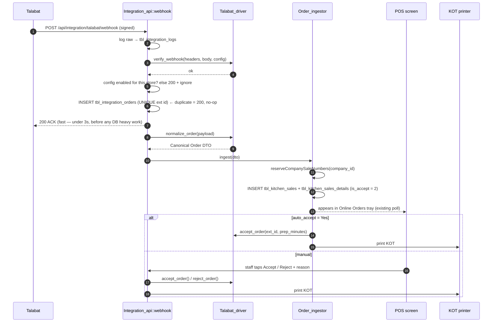

# Integration Platform — Talabat (UAE) first, any channel next

**High-level design.** How an external ordering app pushes an order into this
POS automatically, how the POS pushes status back, and how the whole thing is
built as a *platform* so the second, third and fourth app cost days instead of
weeks.

Companion to [online_aggregator_integration.md](online_aggregator_integration.md),
which answers *can we / should we*. This doc answers **how we build it**.

Target market: **UAE**. First driver: **Talabat**.

---

## 0. The one design decision that matters

Do **not** build "Talabat integration". Build an **integration platform** with a
Talabat *driver* plugged into it.

```
                       ┌──────────────────────────────┐
  Talabat webhook ───► │                              │
  Deliveroo webhook ─► │   Integration_api            │ ── verify, log, dedupe
  Noon webhook ──────► │   (one controller, all apps) │
  Careem webhook ────► │                              │
                       └──────────────┬───────────────┘
                                      │  provider code from the URL
                                      ▼
                       ┌──────────────────────────────┐
                       │  Integration_manager         │  is this provider ON
                       │  (registry + factory)        │  for this outlet?
                       └──────────────┬───────────────┘
                                      ▼
                       ┌──────────────────────────────┐
                       │  Talabat_driver              │  the ONLY file that
                       │  implements Channel_driver   │  knows Talabat's JSON
                       └──────────────┬───────────────┘
                                      ▼
                          Canonical Order DTO          ◄── anti-corruption layer
                                      ▼
                       ┌──────────────────────────────┐
                       │  Order_ingestor              │  knows POS tables only,
                       │  (headless sale builder)     │  never knows Talabat
                       └──────────────┬───────────────┘
                                      ▼
                   tbl_kitchen_sales + tbl_kitchen_sales_details
                              (→ KOT prints, POS shows it)
```

Everything below is in service of that picture. The **Canonical Order DTO** and
the **Channel_driver interface** are the two contracts that make app #2 cheap.

---

## 1. Where this plugs into the existing code

Facts established from the current codebase — the design is shaped by these, not
by a generic template.

| Fact | Where | Consequence for us |
|---|---|---|
| Orders are punched by `add_kitchen_sale_by_ajax()` | [Sale.php:1152](../application/controllers/Sale.php#L1152) | It reads `$this->session->userdata('outlet_id' / 'company_id' / 'user_id')` throughout. **A webhook has no session — we cannot call it.** We need a headless twin. |
| Billing and kitchen are two table pairs | `tbl_sales`+`tbl_sales_details`, `tbl_kitchen_sales`+`tbl_kitchen_sales_details` | An injected order must write the **kitchen** pair to exist as a running order; the **sales** pair is written at settle time. Write only one and either KOT won't print or the sale won't report. |
| Bill numbers come from a server counter | `reserveCompanySaleNumbers()` [my_helper.php:483](../application/helpers/my_helper.php#L483) | The ingestor **must** call this. Never invent a `sale_no`. Format `INV-<company_id>-<n>`. |
| REST layer already exists | `libraries/REST_Controller.php`, example `IR_api.php` | Webhook controller is a copy of the `IR_api` pattern. No new framework. |
| POS already polls for incoming orders | `get_new_orders_ajax()` [Sale.php:2371](../application/controllers/Sale.php#L2371), `self_order_status` / `is_accept` | **Reuse this tray** for aggregator orders. No new push infrastructure, no websockets. |
| Partner master already seeded | `tbl_delivery_partners` — TALABAT, ZOMATO, NOON, UBER rows exist | Link each integration config to one of these rows so existing partner reports keep working. |
| Settings live as columns on `tbl_companies` | `Setting::onlineOrder()` [Setting.php:437](../application/controllers/Setting.php#L437) | Fine for one flag. **Not** fine for N providers × M outlets — we need real config tables (§3). |
| Menus are access-gated by hard-coded ids | `checkAccess($controller,$function)`, `tbl_access`, `userHome.php` | New screens need the 6-step checklist in §8. |
| Migrations are plain SQL files | `Update/*.sql` | Ship `Update/integration_platform_migration.sql`. |
| Three clocks disagree (app Asia/Dubai, MySQL/browser IST, OS UTC) | known issue | **Store every integration timestamp as UTC** and convert on display. Aggregator SLAs are measured in minutes — a 3.5h skew fails them silently. |

---

## 2. Canonical model (the contract)

### 2.1 Canonical Order DTO

Every driver's job is to turn its provider's payload into exactly this. Nothing
downstream may read provider-specific fields.

```php
[
  'provider_code'     => 'talabat',
  'external_order_id' => 'TLB-8829301',      // idempotency key
  'external_order_no' => '8829301',          // short, printed on KOT
  'outlet_id'         => 4,                  // resolved from store_id mapping
  'company_id'        => 1,
  'order_type'        => 3,                  // 3 = Delivery (existing enum)
  'placed_at_utc'     => '2026-08-08T11:04:22Z',
  'pickup_at_utc'     => null,               // set for scheduled orders
  'is_prepaid'        => true,
  'payment_method_id' => 12,                 // per-provider settlement method
  'currency'          => 'AED',
  'price_includes_tax'=> true,               // UAE aggregators quote VAT-inclusive
  'customer' => [
      'name' => 'Talabat Customer', 'phone' => '+9715XXXXXXX',  // usually masked
      'address' => '...', 'lat' => null, 'lng' => null,
  ],
  'items' => [
    [ 'external_item_id' => 'SKU-771',
      'food_menu_id'     => 218,             // resolved via tbl_integration_item_map
      'menu_name'        => 'Chicken Shawarma',
      'qty'              => 2,
      'unit_price'       => 18.00,
      'note'             => 'no garlic',
      'modifiers' => [ [ 'external_id'=>'MOD-9','modifier_id'=>33,'name'=>'Extra sauce','price'=>2.00,'qty'=>1 ] ],
    ],
  ],
  'charges' => [ 'delivery' => 5.00, 'service' => 0.00, 'discount' => 3.00, 'tip' => 0.00 ],
  'totals'  => [ 'sub_total'=>36.00, 'tax'=>1.90, 'total_payable'=>38.00 ],
  'raw'     => '{ ...original json... }',    // stored for disputes
]
```

### 2.2 Canonical status

One vocabulary in the middle; each driver maps its own words on both sides.

| Canonical | Meaning | POS side | Fires outbound? |
|---|---|---|---|
| `RECEIVED` | webhook stored, sale created | kitchen sale, `is_accept = 2` (pending) | ack only |
| `ACCEPTED` | staff/auto accepted | `is_accept = 1`, KOT prints | yes + prep time |
| `REJECTED` | store closed / item 86'd / timeout | sale voided | yes + reason |
| `PREPARING` | in kitchen | `tbl_kitchen_sales.status = 1` | optional |
| `READY` | food ready for the rider | `status = 2` | yes |
| `PICKED_UP` | rider collected | — | inbound only |
| `COMPLETED` | **order settled in POS** | `tbl_sales.order_status = 3` | **yes ← the main ask** |
| `CANCELLED` | cancelled by either side | sale cancelled/refunded | both directions |

Mapping tables live **inside each driver**, never in shared code.

### 2.3 The driver interface

```php
// application/libraries/Integration/Channel_driver_interface.php
interface Channel_driver_interface
{
    public function code();                                  // 'talabat'
    public function capabilities();                          // ['order_in','status_out','menu_push','store_status']

    /* inbound */
    public function verify_webhook($headers, $raw_body, $config);   // bool — HMAC/OAuth
    public function parse_event($raw_body);                         // ['type'=>'order.created','external_order_id'=>..]
    public function normalize_order($payload, $config);              // → Canonical Order DTO

    /* outbound */
    public function accept_order($external_id, $prep_minutes, $config);
    public function reject_order($external_id, $reason_code, $config);
    public function push_status($external_id, $canonical_status, $config);

    /* optional — declare via capabilities() */
    public function push_menu($outlet_id, $config);
    public function set_store_status($external_store_id, $is_open, $config);
    public function set_item_availability($external_item_id, $is_available, $config);
}
```

`Base_channel_driver` (abstract) provides the boring 80%: OAuth2 token fetch +
cache + refresh, signed HTTP with timeout, JSON decode, and a `log()` that writes
every call to `tbl_integration_logs`. A new driver is then ~200–300 lines.

---

## 3. Database (one migration)

`Update/integration_platform_migration.sql` — additive, safe to re-run.

```sql
-- 1. Catalogue of supported apps. Adding a provider later = one INSERT + one driver file.
CREATE TABLE tbl_integration_providers (
  id INT AUTO_INCREMENT PRIMARY KEY,
  code         VARCHAR(40) NOT NULL UNIQUE,      -- 'talabat','deliveroo','noon','careem','deliverect'
  name         VARCHAR(80) NOT NULL,
  driver_class VARCHAR(80) NOT NULL,             -- 'Talabat_driver'
  capabilities VARCHAR(255) DEFAULT '',          -- csv, mirrors capabilities()
  logo         VARCHAR(120) DEFAULT NULL,
  is_active    ENUM('Yes','No') DEFAULT 'Yes',   -- globally available to enable
  sort_order   INT DEFAULT 0
) ENGINE=InnoDB;

-- 2. Per company+outlet+provider settings. THIS holds the on/off switch.
CREATE TABLE tbl_integration_configs (
  id INT AUTO_INCREMENT PRIMARY KEY,
  company_id INT NOT NULL,
  outlet_id  INT NOT NULL,
  provider_id INT NOT NULL,
  is_enabled  ENUM('Yes','No') DEFAULT 'No',     -- ◄── the setting toggle
  external_store_id VARCHAR(80) DEFAULT NULL,    -- their id for this branch
  credentials TEXT DEFAULT NULL,                 -- encrypted JSON (client_id/secret/webhook secret)
  webhook_secret VARCHAR(120) DEFAULT NULL,
  ingest_on      ENUM('placed','accepted') DEFAULT 'accepted', -- when to auto-punch
  auto_accept    ENUM('Yes','No') DEFAULT 'No',
  default_prep_minutes INT DEFAULT 20,
  price_mode     ENUM('delivery','normal') DEFAULT 'delivery', -- sale_price_delivery vs sale_price
  price_includes_tax ENUM('Yes','No') DEFAULT 'Yes',           -- UAE: usually Yes
  payment_method_id  INT DEFAULT NULL,           -- settlement method (e.g. "Talabat Credit")
  delivery_partner_id INT DEFAULT NULL,          -- link to existing tbl_delivery_partners row
  auto_settle    ENUM('Yes','No') DEFAULT 'No',  -- prepaid → close bill automatically
  push_status_on VARCHAR(120) DEFAULT 'ACCEPTED,READY,COMPLETED,CANCELLED',
  is_sandbox     ENUM('Yes','No') DEFAULT 'Yes',
  UNIQUE KEY uq_cfg (company_id, outlet_id, provider_id)
) ENGINE=InnoDB;

-- 3. Item mapping: our menu ↔ their menu.
CREATE TABLE tbl_integration_item_map (
  id INT AUTO_INCREMENT PRIMARY KEY,
  config_id INT NOT NULL,
  map_type ENUM('item','modifier') DEFAULT 'item',
  external_item_id VARCHAR(80) NOT NULL,
  food_menu_id INT DEFAULT NULL,
  modifier_id  INT DEFAULT NULL,
  UNIQUE KEY uq_map (config_id, map_type, external_item_id),
  KEY ix_menu (food_menu_id)
) ENGINE=InnoDB;

-- 4. One row per inbound order. The UNIQUE key is the idempotency guarantee.
CREATE TABLE tbl_integration_orders (
  id INT AUTO_INCREMENT PRIMARY KEY,
  config_id INT NOT NULL,
  provider_code VARCHAR(40) NOT NULL,
  external_order_id VARCHAR(80) NOT NULL,
  external_order_no VARCHAR(40) DEFAULT NULL,
  company_id INT NOT NULL, outlet_id INT NOT NULL,
  kitchen_sale_id INT DEFAULT NULL,
  sale_id INT DEFAULT NULL,
  sale_no VARCHAR(60) DEFAULT NULL,
  canonical_status VARCHAR(20) DEFAULT 'RECEIVED',
  reject_reason VARCHAR(190) DEFAULT NULL,
  raw_payload LONGTEXT,
  received_at_utc DATETIME NOT NULL,
  accepted_at_utc DATETIME DEFAULT NULL,
  completed_at_utc DATETIME DEFAULT NULL,
  UNIQUE KEY uq_ext (provider_code, external_order_id),   -- ◄── retries can never double-punch
  KEY ix_outlet_status (outlet_id, canonical_status)
) ENGINE=InnoDB;

-- 5. Outbound work queue. Makes "POS complete → their side updates" reliable.
CREATE TABLE tbl_integration_events (
  id INT AUTO_INCREMENT PRIMARY KEY,
  integration_order_id INT NOT NULL,
  direction ENUM('out','in') DEFAULT 'out',
  event_type VARCHAR(40) NOT NULL,               -- 'status.push','order.accept','order.reject'
  payload TEXT,
  status ENUM('pending','sent','failed','dead') DEFAULT 'pending',
  attempts INT DEFAULT 0,
  last_error VARCHAR(255) DEFAULT NULL,
  next_attempt_at_utc DATETIME DEFAULT NULL,
  created_at_utc DATETIME NOT NULL,
  KEY ix_due (status, next_attempt_at_utc)
) ENGINE=InnoDB;

-- 6. Raw call log — inbound and outbound — for disputes and support.
CREATE TABLE tbl_integration_logs (
  id BIGINT AUTO_INCREMENT PRIMARY KEY,
  config_id INT DEFAULT NULL,
  provider_code VARCHAR(40) DEFAULT NULL,
  direction ENUM('in','out') NOT NULL,
  endpoint VARCHAR(190) DEFAULT NULL,
  http_status INT DEFAULT NULL,
  request_body LONGTEXT, response_body LONGTEXT,
  duration_ms INT DEFAULT NULL,
  created_at_utc DATETIME NOT NULL,
  KEY ix_prov_time (provider_code, created_at_utc)
) ENGINE=InnoDB;

-- 7. Tag the sale itself so every existing report can filter by channel.
ALTER TABLE tbl_kitchen_sales
  ADD COLUMN channel_code VARCHAR(40) DEFAULT NULL,
  ADD COLUMN external_order_id VARCHAR(80) DEFAULT NULL,
  ADD COLUMN integration_order_id INT DEFAULT NULL;
ALTER TABLE tbl_sales
  ADD COLUMN channel_code VARCHAR(40) DEFAULT NULL,
  ADD COLUMN external_order_id VARCHAR(80) DEFAULT NULL,
  ADD COLUMN integration_order_id INT DEFAULT NULL;

-- 8. Seed the catalogue.
INSERT INTO tbl_integration_providers (code,name,driver_class,capabilities,sort_order) VALUES
 ('talabat','Talabat','Talabat_driver','order_in,status_out,store_status',1),
 ('deliveroo','Deliveroo','Deliveroo_driver','order_in,status_out,menu_push,store_status',2),
 ('noon','Noon Food','Noon_driver','order_in,status_out',3),
 ('careem','Careem Food','Careem_driver','order_in,status_out',4),
 ('deliverect','Deliverect (multi)','Deliverect_driver','order_in,status_out,menu_push,store_status',9)
ON DUPLICATE KEY UPDATE name=VALUES(name);
```

Note `channel_code` on the sale tables: this is what lets **existing** reports
gain a channel filter without a schema rethink later.

---

## 4. Code layout

```
application/
  controllers/
    Integration_api.php          extends REST_Controller — inbound webhooks (public, no session)
    Integration.php              admin UI: providers, settings, item mapping, order log
    Integration_cron.php         CLI-only: outbound queue worker + timeout sweeper
  models/
    Integration_model.php        config lookup, order lookup, event queue
  libraries/Integration/
    Integration_manager.php      registry, is_enabled(), driver factory
    Channel_driver_interface.php the contract (§2.3)
    Base_channel_driver.php      OAuth, HTTP, retry, logging
    Order_ingestor.php           Canonical DTO → POS tables (headless twin of add_kitchen_sale_by_ajax)
    Status_dispatcher.php        POS status change → tbl_integration_events
    Drivers/
      Talabat_driver.php
      Deliveroo_driver.php
      Noon_driver.php
      Deliverect_driver.php
  views/integration/
    settings.php  provider_config.php  item_map.php  order_log.php
  views/sale/POS/               partial: online-orders tray gets a channel badge
```

### 4.1 Routes

```php
// config/routes.php
$route['api/integration/(:any)/webhook']  = 'Integration_api/webhook/$1';   // /api/integration/talabat/webhook
$route['api/integration/(:any)/health']   = 'Integration_api/health/$1';
```

One URL shape for every app. Provider code is a URL segment — **no new route
when app #2 arrives.**

---

## 5. Flow A — order lands in POS automatically

> *"Talabat me jaise hi koi order aaye / button click ho, apne system me
> autopunch ho jaye."*



**`ingest_on` config decides the trigger** — this is the literal answer to
"button click karte hi punch ho":

- `ingest_on = 'placed'` — punch the moment the customer orders. Fastest kitchen
  start, but a customer/aggregator cancellation means we void a punched order.
- `ingest_on = 'accepted'` *(default)* — punch when the order is accepted on the
  Talabat tablet/app. Cleaner books, matches how the counter works today.

Both are the same code path; only the event filter in
`Integration_api::webhook()` differs.

### 5.1 Rules the ingestor must not break

1. **Idempotency first.** `INSERT` into `tbl_integration_orders` before any other
   write. Duplicate key → return 200 immediately. Aggregators retry aggressively;
   without this you get double KOTs on a busy Friday.
2. **ACK fast, work after.** Talabat expects a 2xx within a few seconds or it
   retries/marks the store unreachable. Acknowledge, then ingest.
3. **`sale_no` from the server counter only** — `reserveCompanySaleNumbers()`.
4. **Write the kitchen pair, in a transaction.** Reuse the exact column set from
   [Sale.php:1172-1243](../application/controllers/Sale.php#L1172-L1243):
   `order_type = 3`, `is_online_order = 'Yes'`, `is_accept = 2`,
   `delivery_partner_id` from config, plus the new `channel_code`.
5. **Unmapped item = reject the order**, do not guess. Log which SKU was missing
   so the mapping screen can show it. A silently dropped line item is a refund
   and a rating hit.
6. **Price source** = `price_mode` (default `sale_price_delivery`). If the
   provider sends prices, store **their** price on the detail row — the customer
   already paid that number.
7. **Tax.** UAE aggregator totals are VAT-inclusive. With
   `price_includes_tax = Yes`, back-compute the 5% and fill `sale_vat_objects`
   the same shape the POS builds it, so VAT reports stay correct.
8. **Customer** = one synthetic customer per provider (phones are masked), with
   the real drop address on `del_address`.
9. **Timestamps UTC.** Convert to Asia/Dubai only for display.

---

## 6. Flow B — POS completes, their side updates

> *"Apne system me order complete karein to udher bhi update ho jaye."*

The critical rule: **never make the outbound HTTP call inside the POS request.**
If Talabat is slow, the cashier's screen must not freeze. Enqueue, then push.

```
Sale::update_order_status_ajax()   (Sale.php:3041 — settle/close)
Sale::change_status_of_a_sale_ajax()
Kitchen ready action
        │
        ▼  one line added at each site
Status_dispatcher::on_status_change($sale_id, 'COMPLETED')
        │
        ├─ is this sale an integration order?  (channel_code / integration_order_id)
        ├─ is the provider enabled + status in push_status_on?
        └─ INSERT tbl_integration_events (pending, next_attempt_at = now)
        │
        ▼
Integration_cron::run_queue()        every minute (Windows Task Scheduler / cron)
        │
        ├─ pick due events, FIFO, small batch
        ├─ driver->push_status(ext_id, canonical)
        ├─ 2xx → status = sent
        └─ fail → attempts++, exponential backoff (1m,5m,15m,1h,6h), 6 fails → dead + alert
```

`Status_dispatcher` is deliberately a **single function called from a few
places** rather than scattered `if ($is_talabat)` blocks. That is what keeps app
#2 from touching `Sale.php` at all.

**Cron entry (Windows / Laragon):**

```
php index.php Integration_cron run_queue        # every 1 min — outbound pushes
php index.php Integration_cron sweep_timeouts   # every 5 min — un-accepted orders past SLA → auto reject
php index.php Integration_cron refresh_tokens   # hourly    — OAuth refresh
```

`Integration_cron::__construct()` must hard-block web access
(`if (!is_cli()) show_404();`).

---

## 7. Settings screen (the on/off button)

**Setting → Integrations** — one card per provider, per outlet.

```
┌─────────────────────────────────────────────────────────────┐
│  Integrations                        Outlet: [ Downtown ▼ ] │
├─────────────────────────────────────────────────────────────┤
│  [logo] Talabat                            ●━━  Enabled     │
│         Store ID   TLB-DXB-0042                             │
│         Last order 2 min ago    ● Connected      [Settings] │
├─────────────────────────────────────────────────────────────┤
│  [logo] Deliveroo                          ━━○  Disabled    │
│         Not configured                        [Connect]     │
├─────────────────────────────────────────────────────────────┤
│  [logo] Noon Food                          ━━○  Disabled    │
└─────────────────────────────────────────────────────────────┘
```

The grid is rendered by looping `tbl_integration_providers` — **a new app appears
here automatically** once its catalogue row exists. No view edits.

Per-provider settings drawer: credentials, store id, sandbox/live, `ingest_on`,
auto-accept, default prep time, price mode, tax-inclusive, payment method,
delivery partner, which statuses to push, plus a **Test connection** button.

Toggling off is honoured in three places, all of them cheap:
`Integration_api::webhook()` (ignore inbound with 200),
`Status_dispatcher` (don't enqueue), `Integration_cron` (skip disabled configs).

Secondary screens: **Item Mapping** (our menu ↔ their SKUs, with an unmapped
filter) and **Order Log** (inbound orders, status, raw payload, retry button).

---

## 8. Wiring the new menus (project-specific, easy to miss)

Per the established checklist — six places, and skipping the DB one makes the
menu invisible even for Admin:

1. `Integration_model` — queries.
2. `Integration.php` — controller actions loading `integration/<view>` into `main_content`, then `userHome`.
3. `application/views/integration/*.php` — copy the shape of an existing settings view.
4. `Integration::__construct()` — `elseif ($segment_2 == "...")` branches setting `$controller = "<new tbl_access id>"` and `$function`.
5. `application/views/userHome.php` — `<li data-access="view-<id>" ...>` under Setting. **The Setting block appears twice in the file — edit both.** (`setting/onlineOrder` is at lines 394 and 869 as the pattern to copy.)
6. `tbl_access` rows in the migration (parent + `view`/`update` children), and the lang keys in **all four** `application/language/*/*_lang.php` files.

**Gotcha:** `function_access` is built once at login, and `user_home_buttom.js`
strips any `<li>` whose `data-access` isn't in `window.menu_objects`. After the
migration, everyone must log out and back in.

---

## 9. UAE specifics

| Topic | Decision |
|---|---|
| **Talabat access** | Talabat is Delivery Hero MENA. Direct API is **partner-gated** — needs the merchant's account manager and a POS-partner/certification process. Realistic fast path is a middleware (Deliverect / Grubtech / Otter, all live in UAE) which ships Talabat + Deliveroo + Noon + Careem behind one API. **Our driver architecture makes that a swap of one file, not a redesign.** |
| **VAT** | 5%. Aggregator menu prices are **VAT-inclusive** → `price_includes_tax = Yes`, back-compute tax into `sale_vat_objects`. |
| **Commission** | Deducted by the aggregator on settlement, not visible per order. Book gross revenue against a per-provider payment method (`Talabat Credit`); reconcile monthly against their statement. Do not net commission into the sale. |
| **Currency** | AED only for now; keep `currency` on the DTO so a KSA/Kuwait rollout doesn't need a migration. |
| **Timezone** | Asia/Dubai display, **UTC storage**. This system already has three disagreeing clocks — do not add a fourth convention. |
| **Invoice** | TRN must print on the aggregator sale like any other; the existing invoice template already handles it. |
| **Hosting** | Webhooks need a **public HTTPS endpoint with a valid certificate**. A Laragon/LAN install cannot receive them — the client needs a cloud/VPS deployment or a relay. This is a hard prerequisite, not a nice-to-have. |
| **e-invoicing** | UAE FTA e-invoicing is on the roadmap for phased rollout. Keeping `raw_payload` and gross/tax split per order now makes that easier later. |

---

## 10. Security & reliability checklist

- **Verify every webhook** — HMAC signature or OAuth bearer, per driver. Reject unsigned.
- **Replay window** — reject events with a timestamp older than ~5 minutes.
- **Encrypt credentials at rest** — reuse the existing `Custom::encrypt_decrypt()` helper; never log secrets.
- **IP allowlist** at the web-server level where the provider publishes ranges.
- **Rate-limit** the webhook route per provider.
- **Idempotency** via `uq_ext` (§3.4) — the single most important line in the migration.
- **Queue + backoff** for all outbound; a POS restart must not lose a status push.
- **Dead-letter alerting** — 6 consecutive failures should raise a visible flag in the Order Log, not fail silently.
- **Timeout sweeper** — orders not accepted within the provider's SLA get auto-rejected with a reason. An unacknowledged order is worse than a rejected one.
- **`is_sandbox`** per config so the client can test without live orders.

---

## 11. Adding app #2 — the whole cost

This is the payoff. Adding **Deliveroo** (or Noon, Careem, Zomato, Uber Eats):

1. `INSERT` one row into `tbl_integration_providers`.
2. Create `libraries/Integration/Drivers/Deliveroo_driver.php` extending `Base_channel_driver` (~200–300 lines: auth, signature, payload mapping, status mapping).
3. Add its lang key + logo.
4. Enable it in Settings, fill credentials, map items.
5. Test in sandbox.

**Zero changes to** `Integration_api`, `Order_ingestor`, `Status_dispatcher`,
`Sale.php`, the settings view, routes, or the DB schema. That is the test of
whether this design actually held.

---

## 12. Phasing

| Phase | Deliverable | Notes |
|---|---|---|
| **0** | Commercial: merchant account live, API/middleware access granted, public HTTPS host ready | **Outside our control — the real schedule risk.** Start now, in parallel. |
| **1** | Migration + `Integration_manager` + interface + settings screen + item mapping | Buildable today; no aggregator access needed. |
| **2** | `Integration_api` webhook + `Order_ingestor` + Talabat driver (inbound) + POS tray badge | **The auto-punch.** Testable end-to-end against sandbox/mock payloads. |
| **3** | Accept/reject UI, `Status_dispatcher`, `Integration_cron`, outbound status push | **The completion sync.** |
| **4** | Order log, retries, timeout sweeper, channel-wise sales report | Operational hardening. |
| **5** | Second driver (proves the abstraction) + menu push + item availability / store open-close | Only after 1–4 are live. |

Phases 1–3 are the meaningful release. Phase 1 can start immediately — it does
not depend on anyone's approval queue.

---

## 13. Open questions for the client

1. Talabat **direct** or via middleware (Deliverect/Grubtech/Otter)? Direct = better margin, slow approval. Middleware = weeks faster, monthly fee per outlet.
2. Is the merchant account live, and who is the Talabat account manager?
3. Punch on **order placed** or on **accepted-in-Talabat**? (Sets `ingest_on`.)
4. **Auto-accept**, or must staff tap Accept every time?
5. Where will the POS be hosted? Webhooks require public HTTPS — on-prem-only is a blocker.
6. Aggregator menu price = POS delivery price, or marked up to absorb commission?
7. After go-live, who owns the menu — POS or the Talabat dashboard?
8. Which outlets, and which apps next after Talabat? (Drives driver build order.)

---

## 14. Summary

- The POS already has the REST layer, the delivery-partner master, per-channel
  pricing, the server-side bill counter, and an order tray that polls. **There is
  no architectural blocker.**
- The one thing that cannot be reused as-is is `add_kitchen_sale_by_ajax()` —
  it is session-bound. `Order_ingestor` is its headless twin, and it is the
  single largest piece of work in phase 2.
- Build the **platform**, ship the **Talabat driver** on top of it. The interface
  (§2.3), the canonical DTO (§2.1), and the provider catalogue table (§3.1) are
  what make app #2 a few days instead of a repeat of app #1.
- Outbound status must go through a **queue**, never a blocking call in the POS
  request.
- The technical build is phases 1–3. **The schedule risk is phase 0** — Talabat
  API access is commercial, not technical. Confirm it before committing a date.
