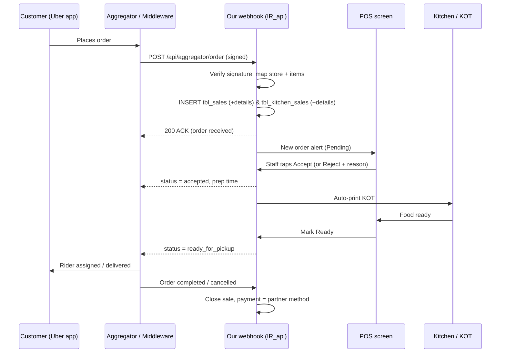

# Online / Aggregator Integration — Feasibility & Plan

Scope: what "online ordering" means in this POS **today**, what a real
Uber Eats / Talabat / Zomato / Noon integration would require, the criteria that
decide whether it is even possible, and the order flow if we build it.

**Status: nothing is integrated today.** What exists is *manual tagging* plus a
first-party (own-brand) online ordering page. No aggregator API code exists in
this codebase.

---

## 1. What exists today

### 1.1 Order types
`tbl_sales.order_type` — `1 = Dine In`, `2 = Take Away`, `3 = Delivery`.
Selected from the POS top bar; delivery pricing has its own price column
(`tbl_food_menus.sale_price_delivery` / `delivery_price`).

### 1.2 First-party online ordering (own page, not an aggregator)
- Enabled per company: **Setting → Online Order Setting** → `sos_enable_online_order`
  (`application/views/authentication/onlineOrderSetting.php`).
- Public URL: `online-order/{outlet_id}/{company_id}` →
  `POSChecker::posAndOnlineOrderMiddleman()`
  ([POSChecker.php:140](../application/controllers/POSChecker.php#L140)).
- It does **not** open a separate storefront — it opens the same POS screen in a
  mobile/online mode (`is_online_order = Yes` session flag) as user id `2`.
- Customer signup/login by phone:
  `Sale::online_customer_login_by_ajax()` ([Sale.php:1073](../application/controllers/Sale.php#L1073)).
- Same pattern is reused for table-QR self ordering:
  `self-order/{table}/{outlet}/{company}/{is_waiter}`.
- Incoming orders land as `self_order_status = Pending` and a staff member
  accepts them (`Sale::set_as_running_order()` → `Approved`).
- Report: `Sale_model::online_order_sales_admin()` filters `is_online_order = Yes`.

### 1.3 "Aggregator" support = a label, nothing more
`tbl_delivery_partners` is a plain master table (name, logo, description).
It is already seeded in this database with **TALABAT, ZOMATO, NOON, UBER**.

Flow: cashier picks `Delivery` → a partner picker modal opens
([main_screen.php:2481](../application/views/sale/POS/main_screen.php#L2481))
→ the chosen id is saved to `tbl_sales.delivery_partner_id`.

That is the whole "integration". The order is **keyed in by hand** by staff
reading it off the aggregator's own tablet.

There is a `tbl_delivery_partners.aggregator_tran_code` column, but it is only
printed as an HTML `data-` attribute
([main_screen.php:2502](../application/views/sale/POS/main_screen.php#L2502)) —
never posted, never stored. Dead scaffolding from the vendor.

Settlement today is done by creating a payment method per partner
(e.g. `Noon Credit` already exists in `tbl_payment_methods`), so the money shows
as received-but-not-cash.

### 1.4 Delivery *fulfilment* — not built, at all

Taking a delivery order and actually **getting the food to the door** are two
different systems. Only the first one exists here.

The order lifecycle stops at billing:

```
New (order_status 1) → Preparing (status 1) → Ready (status 2) → Invoiced (order_status 3) → END
```

There is nothing after "Invoiced". Concretely, the following do **not** exist —
neither in-house nor through any third party:

| Missing | Evidence |
|---|---|
| Rider / driver master | No `tbl_riders` / `tbl_drivers`; no rider role or designation (only Super Admin, Admin, Cashier, Waiter, Chef) |
| Assign order to a rider | No dispatch screen, no assignment column on `tbl_sales` |
| Out-for-delivery / Delivered statuses | Not in the status model |
| Live tracking / map / ETA | No geo data anywhere — `tbl_customer_address.address` is a free-text `varchar(250)`, no lat/long |
| Proof of delivery (OTP, photo, signature) | Not present |
| Rider cash (COD) reconciliation | Not present |
| Rider mobile app | Only a **Waiter** app exists (`IR_api.php`, `Waiter_app.php`) |
| Third-party fleet dispatch (Uber Direct, Careem Express, Shipday, Borzo…) | No code, no credentials table |

The only place the word "Delivered" appears is cosmetic: the customer's order
list prints `Delivered` for any order whose `order_status != 1`
([Order.php:337](../application/controllers/Order.php#L337)) — i.e. it means
*billed*, not *actually delivered*. The Add More Item / View Details / Cancel
links next to it are `href="#"` stubs.

**So today: delivery is fully manual.** Staff phone a rider, hand over the bag,
and the POS never knows what happened next. If the order came from Uber/Talabat,
their own rider network handles it and the POS is not involved — which is fine
operationally, but it means the POS has zero delivery visibility.

### 1.5 What we already have that helps
- `application/libraries/REST_Controller.php` (CodeIgniter REST server) plus a
  working example controller `IR_api.php` → **API infrastructure is ready**.
- `tbl_food_menus.show_online` and `sale_price_delivery` → per-channel menu
  visibility and pricing already modelled.
- Kitchen pipeline (`tbl_kitchen_sales` + `tbl_kitchen_sales_details`) is
  separate from billing (`tbl_sales` + `tbl_sales_details`) — any injected order
  must write **both** or KOT will not print.

---

## 2. Pain points of the current manual flow

| Problem | Effect |
|---|---|
| Staff re-type every aggregator order | Wrong items, wrong quantities during rush |
| Menu/price lives in two places | Aggregator price drifts from POS price |
| Item sold out in POS, still live on the app | Cancellations, rating damage |
| No aggregator order id on the sale | Month-end reconciliation is manual |
| Separate tablet per aggregator | "Tablet hell" — 3–4 devices at the counter |

---

## 3. Eligibility criteria — read this before promising anything

An aggregator integration is **not** a purely technical decision. All of the
following must be true, in order:

**Business / contractual**
1. The restaurant must be a **live merchant** on that aggregator with an active
   contract. No merchant account → no integration.
2. The aggregator must **approve us as a POS/integration partner**. Uber Eats,
   Deliveroo, Talabat and Careem all run a partner/developer programme with an
   application, review and (usually) a certification test. This can take weeks
   to months and can be refused.
3. Some aggregators only open their API to partners with a **minimum number of
   connected stores** — a single-restaurant client often does not qualify.
4. Commercials: some charge an integration/POS fee, or require a revenue share.

**Technical prerequisites on our side**
5. A **publicly reachable HTTPS endpoint** with a valid certificate. Webhooks
   are pushed to us; a Laragon/localhost or LAN-only install cannot receive
   them. If the client runs the POS on-premise only, we need a cloud relay.
6. Stable, unique **outlet ↔ aggregator store id** mapping (this system is
   already multi-outlet, so this fits).
7. Stable **menu item codes**. `tbl_food_menus.code` exists — it must actually
   be filled and unique, which is not enforced today.
8. Secret storage + request signature verification (HMAC / OAuth2 client
   credentials, depending on the aggregator).
9. The POS must be **online 24/7** during trading hours. If it drops, orders
   must queue and replay, not vanish.

**Operational**
10. Someone must own menu publishing. Once the menu is pushed from the POS, the
    aggregator dashboard becomes read-only in practice — the client must stop
    editing prices there.
11. Tax/commission handling must be agreed up front: does the aggregator price
    include our VAT? Is commission deducted before or after tax?

> Rule of thumb: if criteria 1–3 are not already satisfied by the client, stop.
> The build is the easy part; getting API access is the slow part.

---

## 4. What can realistically be integrated

| Platform | API availability | Notes |
|---|---|---|
| **Uber Eats** | Yes — public partner programme | Best documented. Order push webhook + menu upload + store status. Needs partner approval. |
| **Deliveroo** | Yes — partner programme | Similar model to Uber. |
| **Talabat (UAE/MENA)** | Yes, but partner-gated | Usually routed through an approved middleware. Direct access is hard for a single POS vendor. |
| **Careem / Noon Food** | Partner-gated | Regional; access via account manager. |
| **Zomato / Swiggy (India)** | Partner-gated | Practically only via approved middleware (UrbanPiper etc.). |
| **DoorDash / Grubhub (US)** | Yes — open developer portal | Only relevant if the client trades in the US. |

### 4.1 Two different third-party things — don't confuse them

| | **Marketplace aggregator** | **Delivery-as-a-service (fleet)** |
|---|---|---|
| Examples | Uber Eats, Talabat, Zomato, Deliveroo, Noon Food | Uber Direct, Careem Express, Shipday, Borzo, Dunzo, Lalamove |
| Brings | The customer **and** the rider | Only the rider |
| Order comes from | Their app | **Our** channel (phone, our online page, walk-in) |
| Who owns the customer | They do | We do |
| Commission | High (~20–35%) | Flat per-delivery fee |
| Solves | Demand | Fulfilment (section 1.4) |

The table in section 4 above covers the **marketplace** side. If the client's
real problem is "hum khud order lete hain par delivery ka koi system nahi hai",
then a **fleet API** is the answer, not an aggregator:

- POS calls `create_delivery` with pickup + drop address once the order is Ready.
- Provider assigns a rider and returns a tracking URL.
- Provider webhooks us: `assigned → picked_up → delivered`, which finally gives
  `tbl_sales` a real delivery status.
- Customer gets the tracking link by SMS (a `Textlocal` SMS library already
  exists in `application/libraries/`).

Fleet APIs are usually **self-serve** — no partner approval queue, so criteria
2–3 in section 3 mostly disappear. They are the faster win.

### 4.2 Direct vs middleware — pick one

**Option A — Direct integration per aggregator.**
We build one connector per platform. Best margins and no third-party fee, but
each aggregator = its own auth, its own menu schema, its own certification, and
its own ongoing maintenance when they change the API.

**Option B — One middleware, many aggregators.**
Integrate once against **Deliverect / Otter / UrbanPiper / Grubtech**. They
already hold the aggregator partnerships, so criteria 2–3 above become their
problem. We build a single connector and get Uber + Talabat + Deliveroo + Noon
at once. Cost: a monthly per-outlet fee paid by the client.

**Recommendation: Option B for the first release.** One connector, fastest to
market, and it side-steps the partner-approval bottleneck. Move a specific
aggregator to a direct connector later only if volume justifies it.

---

## 5. Integration levels — scope the ask

| Level | What it does | Effort |
|---|---|---|
| **L0 — today** | Manual keying, partner tag on the sale | done |
| **L1 — Order injection** | Aggregator order lands in POS automatically, KOT prints, staff accepts/rejects | Small–Medium |
| **L2 — + Status & stock** | POS pushes accepted / preparing / ready / picked-up back; item 86'ing (sold out) syncs; store open/close/busy | Medium |
| **L3 — + Menu & settlement** | Menu, prices, modifiers, images published from POS to the aggregator; per-partner settlement + commission reconciliation report | Large |
| **LD — Own-order delivery** | *Independent track.* Rider statuses on the sale + third-party fleet dispatch + tracking link to customer (section 4.1) | Medium |

L1 alone removes ~80% of the operational pain on the aggregator side. Suggest
shipping L1 first.

**LD is a separate track, not a later phase.** It fixes the gap in section 1.4
and applies only to orders the restaurant takes itself. It can be built before,
after, or in parallel with L1 — and unlike L1 it is not blocked on anyone's
partner-approval queue.

---

## 6. Proposed order flow (L1 + L2)



**Rejection path:** if the store is closed, an item is 86'd, or nobody accepts
within the timeout, we call back with `denied` + reason — the aggregator refunds
the customer. This must be implemented, not skipped; an unacknowledged order is
worse than a rejected one.

**Key mapping decisions**
- `order_type` = `3` (Delivery).
- `delivery_partner_id` = the matched row in `tbl_delivery_partners` (Uber/Talabat rows already exist).
- `aggregator_tran_code` finally gets used: store the aggregator's order id on
  the **sale**, not the partner master — it needs a new column on `tbl_sales`.
- Customer = a synthetic customer per order (aggregators mask real phone numbers).
- Payment = pre-paid on the aggregator → settle against a per-partner payment
  method, `paid_amount = total_payable`, due `0`.
- Price source = `sale_price_delivery`, not `sale_price`.

---

## 7. What we would have to build

**Database (new migration)**
- `tbl_sales`: `aggregator_order_id`, `aggregator_partner_id`, `aggregator_status`,
  `aggregator_payload` (raw JSON, for disputes).
- `tbl_aggregator_credentials`: outlet_id, partner, store_id, client_id,
  secret/token, token_expiry.
- `tbl_aggregator_item_map`: our `food_menu_id` ↔ their item id (+ modifier map).
- `tbl_aggregator_logs`: every inbound/outbound call, for debugging and replay.

**Code**
- `application/controllers/Aggregator_api.php` — extend `REST_Controller`,
  same pattern as `IR_api.php`. Endpoints: receive order, cancel, status ping.
- `application/libraries/Aggregator/` — one small driver class per platform
  behind a common interface (`fetchOrder`, `acceptOrder`, `rejectOrder`,
  `pushStatus`, `pushMenu`, `setStoreStatus`).
- A **sale-builder service** that writes `tbl_sales` + `tbl_sales_details` +
  `tbl_kitchen_sales` + `tbl_kitchen_sales_details` consistently. This must
  reuse the same numbering path as the POS (`tbl_sale_no_counters`) so bill
  numbers stay unique — see `docs/sale_no_format_feature.md`.
- POS UI: an "Online Orders" tray with Accept / Reject + reason, prep-time
  picker, and a visual partner badge on the order card.
- Settings screen: per-outlet credentials, store id, auto-accept on/off,
  default prep time.
- Reports: sales by partner, commission, rejected/cancelled orders.

**Additionally for LD (own-order delivery)**
- `tbl_sales`: `delivery_status` (assigned / picked_up / delivered / failed),
  `rider_id`, `fleet_provider`, `fleet_job_id`, `tracking_url`,
  `delivered_at`.
- `tbl_customer_address`: `latitude`, `longitude` — a fleet API will not accept
  a free-text address alone.
- Either `tbl_riders` (in-house riders + a simple dispatch screen) **or** a
  fleet driver (`createDelivery`, `cancelDelivery`, status webhook) — or both,
  with a per-order choice of "our rider" vs "book a courier".
- Tracking link to the customer via the existing `Textlocal` SMS library.
- Report: delivery time, late deliveries, failed deliveries, rider COD balance.

**Ops**
- Public HTTPS host + SSL.
- A retry/queue worker so a POS restart does not lose orders.
- Idempotency: the same aggregator order id must never create two sales
  (aggregators retry webhooks).

---

## 8. Rough phasing

| Phase | Deliverable | Depends on |
|---|---|---|
| 0 | Client confirms merchant accounts + we get API/middleware access | client + aggregator |
| 1 | DB migration, credentials screen, item mapping screen | — |
| 2 | Inbound webhook + sale builder + KOT print (L1) | phase 1 |
| 3 | POS accept/reject UI + status callbacks (L2) | phase 2 |
| 4 | Sold-out sync + store open/close/busy | phase 3 |
| 5 | Menu publish + settlement/commission report (L3) | phase 4 |

Phases 1–3 are the meaningful release. Phase 0 is the real schedule risk and is
outside our control.

---

## 9. Open questions for the client

1. Which aggregators, and in which country/market? (Determines direct vs middleware.)
2. Are the merchant accounts already live, and who is the account manager?
3. Is the client willing to pay a middleware subscription per outlet?
4. Is the POS server internet-facing, or on-premise only?
5. Should online orders **auto-accept**, or always wait for staff to tap Accept?
6. Aggregator menu prices — same as POS delivery price, or marked up to absorb
   commission?
7. Who owns the menu after go-live: the POS, or the aggregator dashboard?
8. For the restaurant's **own** delivery orders — in-house riders, or book a
   third-party courier per order? (Decides LD scope: dispatch screen vs fleet API.)
9. Does the client need customer-facing live tracking, or is "order dispatched"
   enough?

---

## 10. Honest summary

- Uber / Talabat / Zomato **can** be integrated — the codebase already has the
  REST layer, the delivery-partner master, the per-channel pricing, and the
  order/kitchen pipeline. There is no architectural blocker.
- Nothing is integrated **today**; the current feature is a manual label plus a
  first-party ordering page.
- **The end-to-end delivery process does not exist** (section 1.4). The system
  tracks an order until it is billed and then forgets it — no rider, no
  dispatch, no delivered status, no tracking, in-house or third-party. When an
  order comes from Uber/Talabat their riders cover it invisibly, but for the
  restaurant's own orders there is simply no fulfilment module.
- The hard part on the aggregator side is commercial access, not code. Confirm
  section 3 criteria 1–3 before committing a delivery date.
- Two independent recommendations:
  - **Demand:** middleware (Deliverect/Otter/UrbanPiper) + Level 1 order
    injection, then status sync and menu publishing.
  - **Fulfilment:** Level LD — delivery statuses on the sale plus one fleet
    provider. Self-serve APIs, no approval queue, so this can start immediately.
